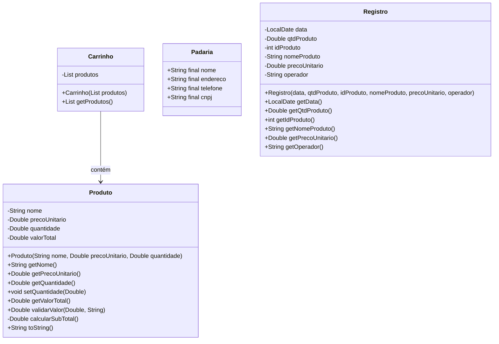

# Padaria
Projeto pessoal feito em console Java visando auxiliar nas tarefas de caixa. 

## Funcionalidades
Possui as seguintes funcionalidades:
- Carrinho
- Operador: Escolher
- Produtos: Gerenciar
- Fluxo de Caixa

## Diagrama de Classes

