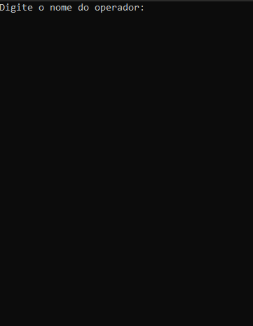
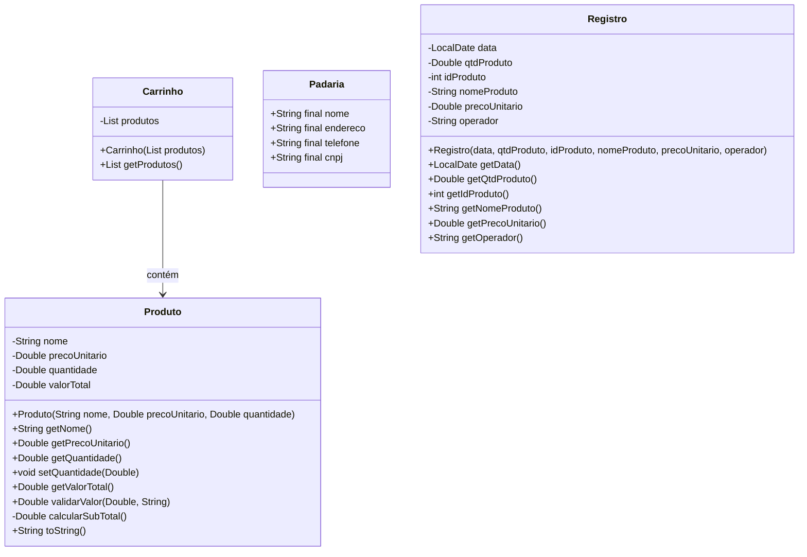

# Padaria
Aplicação em Java para execução via console. O projeto permite o gerenciamento de produtos, estoque, vendas e geração de relatórios simples.

## 🚧 Status do Projeto
🚧 Em desenvolvimento

## 📋 Funcionalidades
- Cadastro de produtos  
- Atualização e consulta de estoque  (🚧 Em desenvolvimento)
- Registro de vendas com cálculo automático do valor total  
- Relatórios de produtos e vendas  

## 🧪 Demonstração
&nbsp;&nbsp;&nbsp;&nbsp;


## 💻 Tecnologias Utilizadas
- Java 17
- Execução via terminal (console)
- Orientação a Objetos

## ▶️ Como Executar
1. Clone o repositório:
   ```bash
   git clone https://github.com/matheusvilar2019/Padaria.git
   ```
2. Acesse a pasta do projeto:
   ```bash
   cd Padaria
   ```
3. Compile os arquivos Java:
   ```bash
   javac -d out -sourcepath src src/Main.java
   ```
4. Execute o programa:
   ```bash
   java -cp out Main
   ```

## 🧩 Diagrama de Classes

   
## ⭐ Autor
Desenvolvido por [Matheus Vilar](https://github.com/matheusvilar2019)
