# Padaria
Projeto pessoal feito em console Java visando auxiliar nas tarefas de caixa. 

## Funcionalidades
Possui as seguintes funcionalidades:
- Carrinho
- Operador
- Adicionar novos produtos
- Importar arquivo

## Diagrama de Classes

```mermaid
classDiagram
        Carrinho --> Produto : contém
        Carrinho --> Nota : gera
        Nota --> Produto : inclui
    class Carrinho{
      -List<Produto> produtos
      -Double valorTotal
      -Boolean CPFNota
      -String operador
      +Carrinho(List<Produto>, Boolean, String)
      +List<Produto> getProdutos()
      +Double getValorTotal()
      +boolean getCPFNota()
      +Double calculaValorTotal()
      +String pagar(Double)
    }    
    class Nota{
      -String nomeCliente
      -String CPFCliente
      -Boolean CPFNota
      -List<Produto> produtos
      -Double total
      -Double pago
      -Double troco
      -String nomeLoja
      -String endereco
      -String telefone
      -String cnpj
      -String operador
      +Nota(String, String, boolean, List<Produto>, Double, Double, Double, String)
      +public String getNomeCliente()
      +String getCPFCliente()
      +boolean getCPFNota()
      +List<Produto> getProdutos()
      +String gerarNota()
      -String formatarProduto(Produto)
    }
    class Produto{
      -String nome
      -Double precoUnitario
      -Double quantidade
      -Double valorTotal
      +Produto(String, Double, Double)
      +String getNome()
      +Double getPrecoUnitario()
      +Double getQuantidade()
      +void setQuantidade(Double)
      +Double getValorTotal()
      +Double validarValor(Double, String)
      -Double calcularSubTotal()
      +String toString()
    }
```

